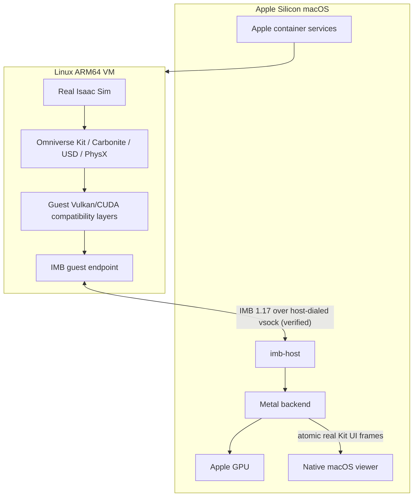
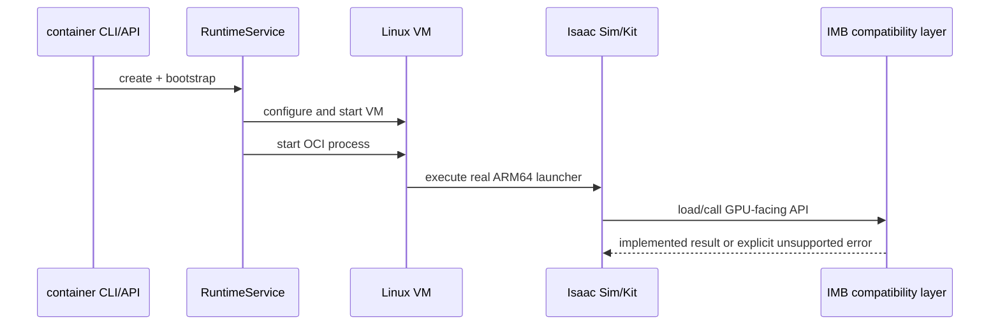
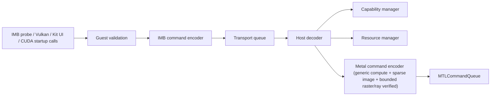
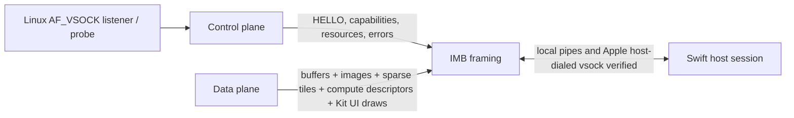
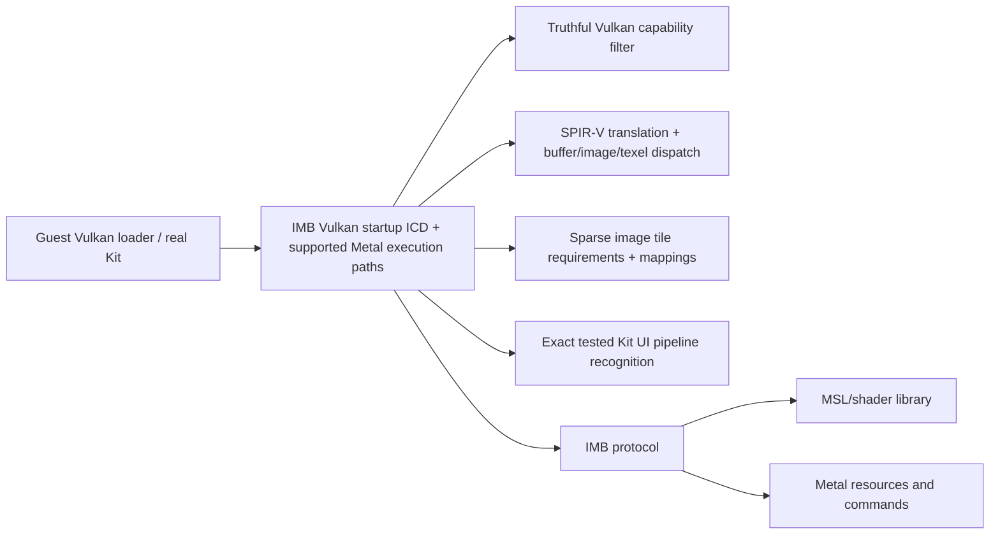
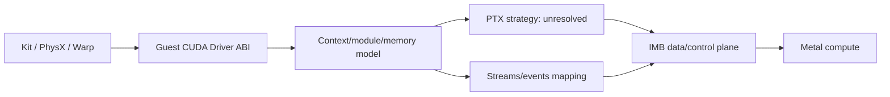
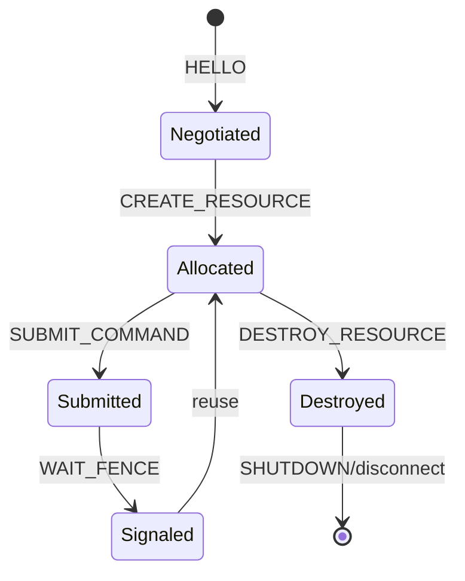
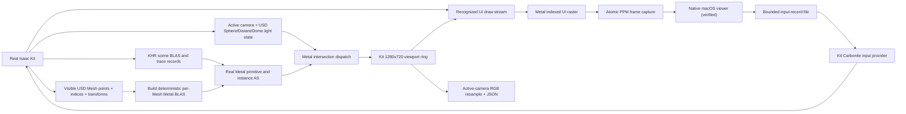

# Architecture

IsaacMetalBridge is an unofficial experimental compatibility layer.
It is not affiliated with, endorsed by, sponsored by, or supported by Apple Inc. or NVIDIA Corporation.

Rendering blocks distinguish the verified fixed-triangle and Kit UI slices from future RTX/general rendering.

## 1. Full system architecture

## 2. Isaac Sim execution path

## 3. GPU command path

## 4. Host/guest communication

Apple's audited API supports the host dialing a guest vsock port. `imb-container-host` now uses that exact API and has completed a real ARM64 VM session. Shared memory and a custom VirtIO GPU remain unverified mechanisms.

## 5. Vulkan bridge prototype

The ICD must advertise only implemented limits/features and return standard errors for unsupported behavior.

## 6. CUDA startup bridge and future execution path

The tested context/memory/stream/event/module and private export-table startup calls are implemented locally in the guest shim. CUDA kernel execution, PTX conversion, and Metal stream semantics remain unresolved; GPU PhysX may remain blocked.

## 7. Resource lifecycle

Resource and fence IDs are host-issued. Disconnect destroys session-owned state. Protocol 1.17 buffer resources are real shared `MTLBuffer` objects; linear and sparse images are real `MTLTexture` objects, with sparse images owning Metal heaps and tile mappings including RGBA8 sRGB, BC3 sRGB, and BC5 UNORM; translated compute pipelines are real `MTLComputePipelineState` objects; primitive/instance acceleration resources own real Metal acceleration structures; and compute, raster, UI, sparse-map, and ray fences correspond to committed Metal command buffers. Generic compute bindings carry buffers, images, formatted texel-buffer views, independent sampler state, and push constants. Ray submissions can carry a validated live Kit camera and bounded positional-, distant-, and dome-light records. The positional wire record preserves SphereLight or carries a guest-generated center-point/equal-area-radius hard approximation of RectLight/DiskLight. The option-bit-4 zero-AS ray form renders the perspective empty-stage guide and axes from that camera into Kit's landscape viewport images without replacing the USD stage or its UI atlas. A separate atomic scene-state v15 sideband adds each visible USD Mesh's real points, triangulated indices, normalized authored corner normals, optional corner UVs, direct material constants, standard opacity/opacityThreshold, bounds, flags, transform, and five indices into a globally deduplicated RGBA8 base/roughness/metallic/emission/normal image table so the guest can build deterministic per-Mesh Metal BLASes; v3-v14 parsing and v3/v4 bounds matching remain backward compatible. `materialBind` GeomSubsets become disjoint face records. Traversal enables native scenegraph instance proxies. The extension converts `omni.timeline` seconds to stage time codes and asks OpenUSD to evaluate camera, transforms, Mesh attributes, lights, proxy transforms, and PointInstancer prototype indices, positions, quaternion orientations, scales, IDs, masks, prototype-root transforms, and instancer transforms at that current time. Each visible prototype Mesh is emitted with a synthetic stable path and composed matrix. Static changes advance the Mesh/light/material sequence and rebuild the fallback TLAS; camera-only changes advance a separate camera sequence and reuse the TLAS from the 160-byte header. A content hash excluding path and world transform lets transform-only occurrences reuse the same Metal BLAS/material resources after static updates. The guest resolves standard `UsdTransform2d` chains and bakes scale-rotate-translate into corner UVs before transport. Vertex format 6 appends tangent and bitangent vectors derived from real triangle positions and transformed UV derivatives. The host transforms three normals, barycentrically interpolates normals/UVs, transforms and orthogonalizes the TBN basis, and retains two float4 direct-material records per TLAS instance. Parameter images use a 48-byte `MBM1 v1` descriptor with four host image IDs; `MBM1 v2` is 56 bytes and adds the normal image plus a bounded legacy alpha-cutout flag; `MBM1 v3` is 64 bytes and adds explicit standard-opacity/base-alpha flags plus opacity and opacityThreshold. The host validates the descriptor before binding up to 126 unique textures. Tagged Warehouse Barcode/WallBoard intersections sample base alpha first and advance the ray through values below `0.3333`. Standard v3 opacity uses the authored threshold and optional base alpha: positive thresholds perform cutout re-intersection, while zero-threshold fractional hits are shaded and source-over composed front-to-back in linear color. Positional-light/DistantLight shadow rays make the same decision and accumulate transmittance. Both primary and shadow paths have a 64-intersection cap. Base/emission texture samples use sRGB-to-linear transfer before lighting and completed linear output is encoded to sRGB. The real Simple Grid texture is loaded directly by the host from the launcher's asset cache. The host can atomically capture completed Kit UI targets for the native viewer. Unsupported broader descriptor/material graphs, colored absorption and refraction/volume/thin-walled semantics, authored tangents, different UV sources within one material, orientation-dependent area emission, nested instancing and per-instance primvar overrides, animated material inputs, robust skinning/deformation, and general RTX/Hydra shader semantics remain incomplete.

## 8. Rendering flow

## Component boundaries

Guest: the verified probe/listener, Vulkan ICD, CUDA startup shim, timer compatibility shim, and Kit input/stage extensions today; NVML remains future work. Transport: bounded framing and verified vsock for GPU work plus per-run bind-mounted stage/input/scene-state/sensor files, with bulk-transfer mechanisms still future work. Host: decoder, capability manager, real buffer/linear-and-sparse-image/pipeline/acceleration-structure resource manager, real Simple Grid and scene-state material textures/constants, frame capture, and interactive native viewer. Metal: shared buffers, linear and sparse textures, translated compute dispatch, deterministic authored-Mesh, native-instance-proxy, and current-time PointInstancer-expanded primitive acceleration structures plus the refreshable fallback instance structure, per-triangle authored-normal and UV barycentric interpolation with geometric fallback, derived tangent-space basis, file base/roughness/metallic/emission/normal sampling, bounded diffuse-specular shading plus direct or mapped emission, primary and hard-shadow TLAS rays using the live Kit camera and bounded positional/Distant/Dome light arrays, one fixed raster pipeline, and the tested Kit UI pipeline. SphereLight is direct; RectLight/DiskLight are explicit hard center-point approximations. The completed camera image can be resampled into the one-shot RGB contract without adding a second RTX Render Graph. Broader material networks, authored tangents/normal strength, nested instancing and per-instance primvar overrides, animated material inputs, robust skinning/deformation, broader raster/descriptor semantics, true soft/area-light shadows and remaining light schemas, and native RTX annotator/sensor arrays remain future work.
