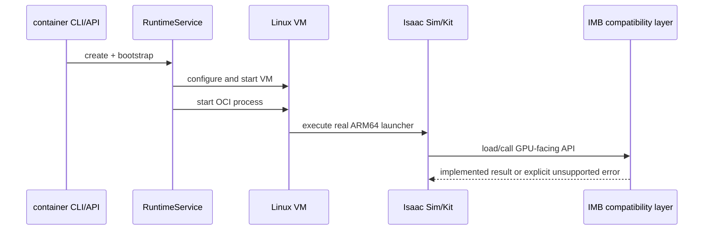
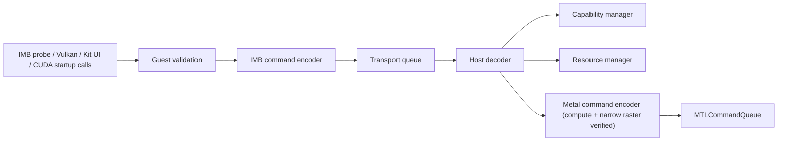
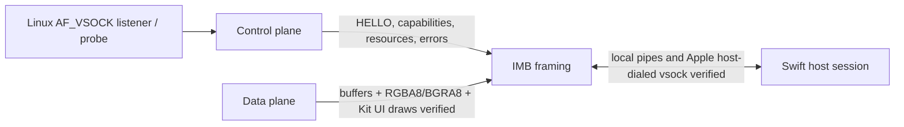
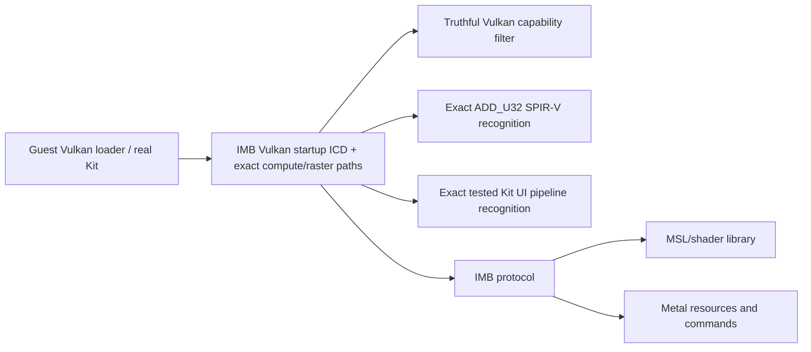
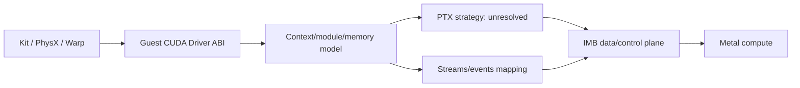
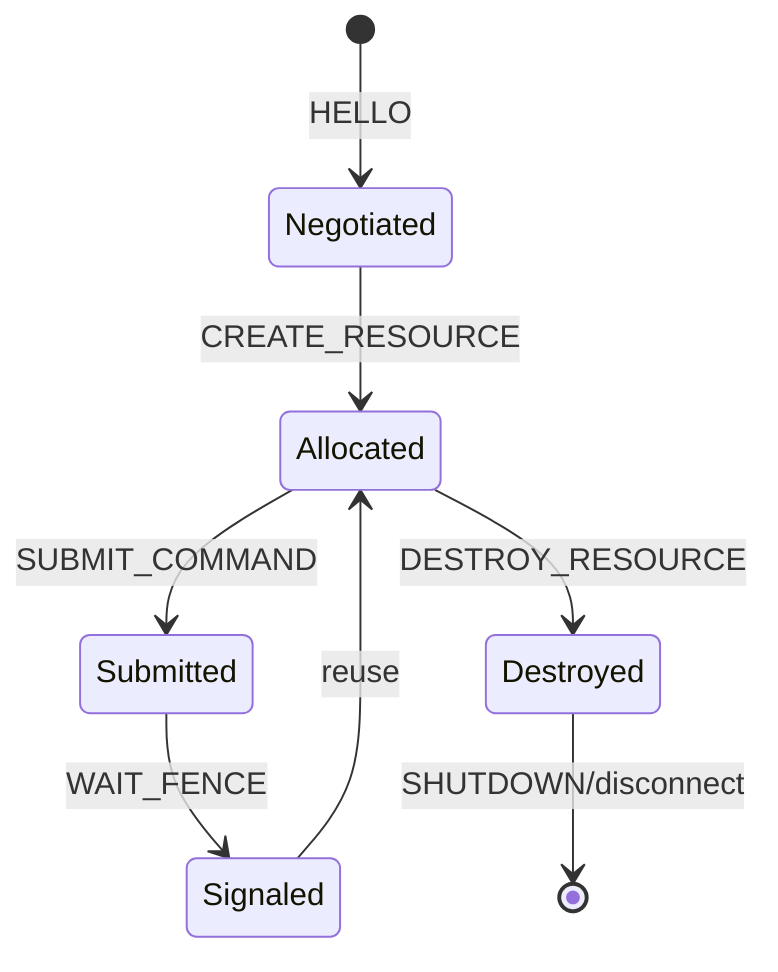

# Architecture

IsaacMetalBridge is an unofficial experimental compatibility layer.
It is not affiliated with, endorsed by, sponsored by, or supported by Apple Inc. or NVIDIA Corporation.

Rendering blocks distinguish the verified fixed-triangle and Kit UI slices from future RTX/general rendering.

## 1. Full system architecture

## 2. Isaac Sim execution path

## 3. GPU command path

## 4. Host/guest communication

Apple's audited API supports the host dialing a guest vsock port. `imb-container-host` now uses that exact API and has completed a real ARM64 VM session. Shared memory and a custom VirtIO GPU remain unverified mechanisms.

## 5. Vulkan bridge prototype

The ICD must advertise only implemented limits/features and return standard errors for unsupported behavior.

## 6. CUDA startup bridge and future execution path

The tested context/memory/stream/event/module and private export-table startup calls are implemented locally in the guest shim. CUDA kernel execution, PTX conversion, and Metal stream semantics remain unresolved; GPU PhysX may remain blocked.

## 7. Resource lifecycle

Resource and fence IDs are host-issued. Disconnect destroys session-owned state. Protocol 1.7 buffer resources are real shared `MTLBuffer` objects; RGBA8/BGRA8 images are real shared `MTLTexture` objects; translated compute pipeline resources are real `MTLComputePipelineState` objects; primitive/instance acceleration resources own real Metal acceleration structures; and compute, raster, UI, and ray fences correspond to real committed Metal command buffers. The host can atomically capture completed Kit UI targets for the native viewer. General descriptor/dispatch transport, additional texture formats, and general RTX/Hydra shader semantics remain unimplemented.

## 8. Rendering flow

```mermaid
flowchart LR
  KIT["Real Isaac Kit"] --> UI["Recognized UI draw stream"]
  KIT --> KHR["KHR scene BLAS and trace records"]
  KHR --> AS["Real Metal primitive and instance AS"]
  AS --> RAY["Metal intersection dispatch"]
  RAY --> VP["Kit 1280x720 viewport ring"]
  VP --> UI
  UI --> MET["Metal indexed UI raster"]
  MET --> CAP["Atomic PPM frame capture"]
  CAP --> VIEW["Native macOS viewer (verified)"]
  VIEW --> EVT["Bounded input-record file"]
  EVT --> INJ["Kit Carbonite input provider"]
  INJ --> KIT
```

## Component boundaries

Guest: the verified probe/listener, Vulkan ICD, CUDA startup shim, and Kit input extension today; NVML remains future work. Transport: bounded framing and verified vsock for GPU work plus a per-run read-only bind-mounted input-record file, with bulk-transfer mechanisms still future work. Host: decoder, capability manager, real buffer/image/pipeline/acceleration-structure resource manager, frame capture, and interactive native viewer. Metal: shared buffers, RGBA8/BGRA8 textures, translated compute pipeline creation, primitive/instance acceleration structures, bounded ray dispatch, one fixed raster pipeline, and the exact tested Kit UI pipeline. General translated dispatch, live Kit camera/scene transforms, translated hit/miss semantics, materials, lighting, and RTX sensors remain future work.
